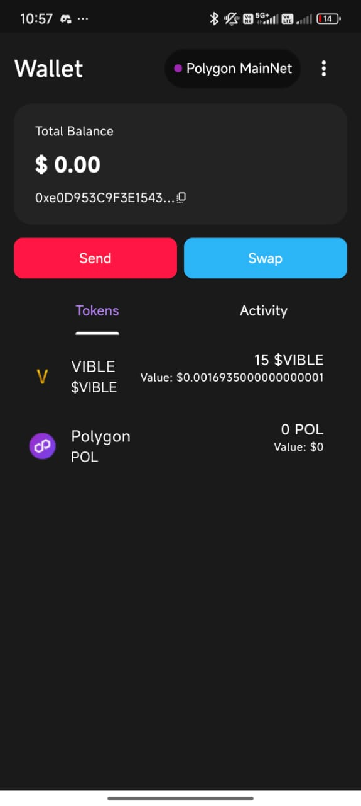
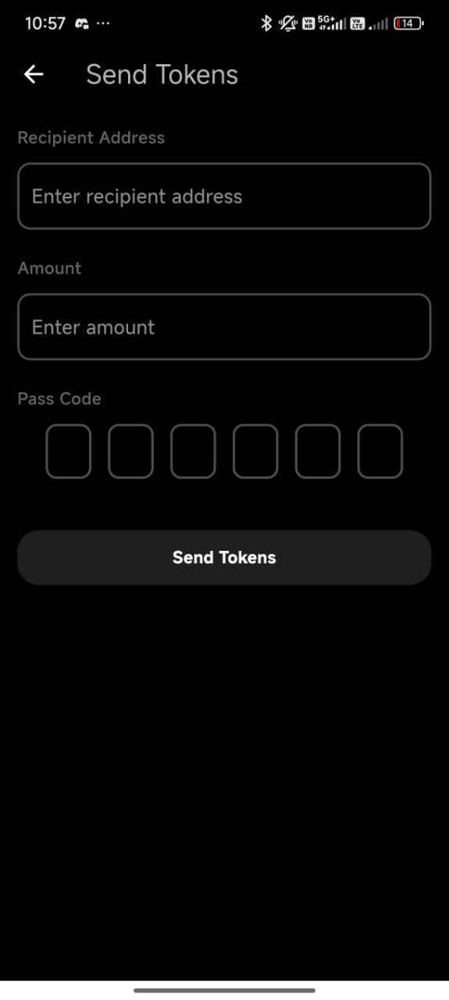
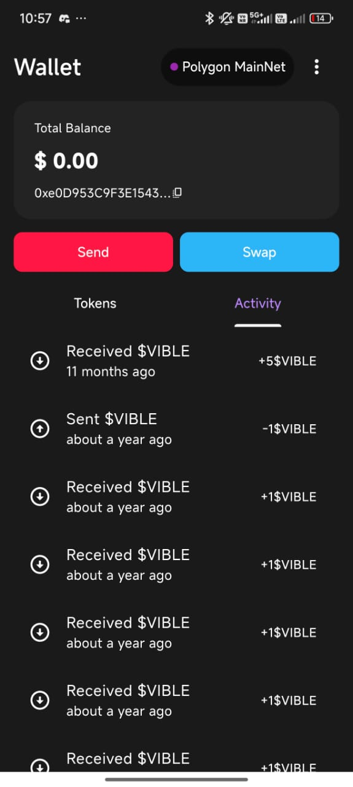
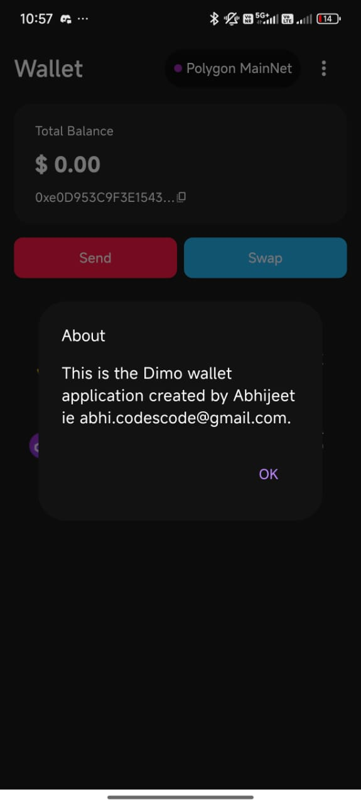

# 🪙 Dimo Wallet

**Dimo Wallet** is a secure and user-friendly **Flutter application** for managing digital assets on the **Polygon network**. It enables users to create wallets, transfer tokens securely, and monitor balances and transactions effortlessly.

---

## 🔑 Features

* **Wallet Creation** – Create and manage wallets with custom names and passcodes.
* **Token Transfers** – Send tokens securely with passcode verification.
* **Balance Tracking** – Monitor real-time wallet balances and view full transaction history.
* **Responsive UI** – Built with **Flutter** and **GetX** for a smooth, intuitive user experience.

## 📱 App Preview

### 🏠 Wallet Home
<p align="">
  <br>
  <em>Home screen showing wallet balance and recent transactions</em>
</p>

### 💸 Send Tokens
<p align="">
  <br>
  <em>Send screen with passcode-verified token transfers</em>
</p>

### 📜 Wallet History
<p align="">
  <br>
  <em>Transaction history showing complete token activity on the Polygon network</em>
</p>

### ℹ️ About
<p align="">
  <br>
  <em>About section with app version and developer info (Abhijeet Khare)</em>
</p>


## 🚀 Getting Started

To run Dimo Wallet locally:

1. Clone the repository

   ```bash
   git clone https://github.com/your-username/dimo-wallet.git
   cd dimo-wallet
   ```
2. Install dependencies

   ```bash
   flutter pub get
   ```
3. Run the app

   ```bash
   flutter run
   ```

📦 Or download the prebuilt APK from the [Releases](https://github.com/your-username/dimo-wallet/releases) section and install it directly on your Android device.

---

## 📦 Dependencies

* **Flutter** – Cross-platform development framework
* **GetX** – State management and routing
* **HTTP** – Network requests to interact with the Polygon network
* **Shared Preferences** – Local data persistence

---

## 🤝 Contributing

Contributions are welcome!
Fork the repository, create a feature branch, and submit a pull request for enhancements or bug fixes.

---

## 👨‍💻 Author

**Abhijeet Khare**
[LinkedIn](https://linkedin.com/in/abhijeet-k) | [GitHub](https://github.com/abhi-codescode)

---
